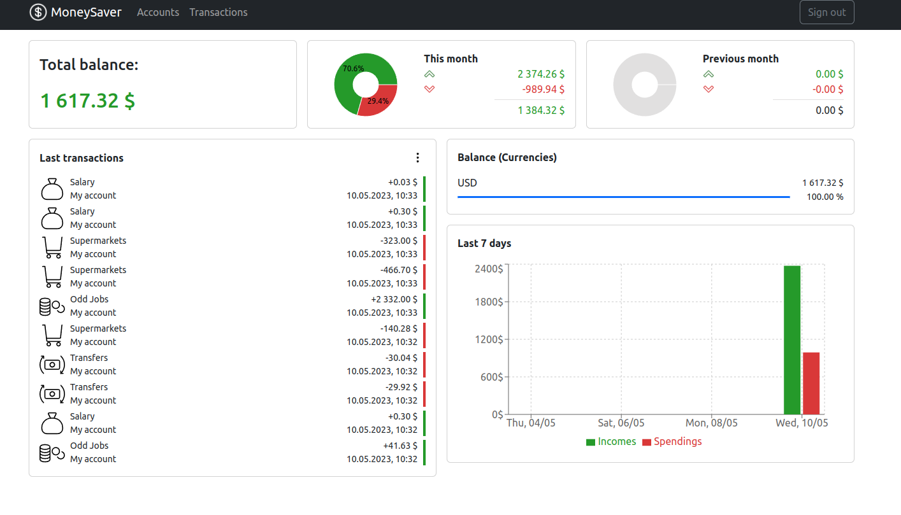

# MoneySaver
Handy budgeting application


---
## Review 

It's web application, that uses fastapi on the backend and react on the frontend. 
From databases, the application uses postgreSQL, redis.
In the application you can add accounts, transactions, as well as edit and delete them.
On the main page, the application shows widgets that help you correctly analyze the budget.


## Installation

1. Copy project - 
    ```commandline
    git clone https://github.com/Wesson1337/MoneySaver.git
    ```
2. Install docker - https://docs.docker.com/engine/install/
3. Set up env variables (check environment variables paragraph).
4. Build up containers. Dev version -
    ```commandline
    docker compose up --build
    ``` 
    or prod version -
    ```commandline
    docker compose -f docker-compose.prod.yml up --build
    ```

5. Go to localhost in your browser.

## Environment variables

To use application you should create .env and .env.prod files in root directory of the project.
You should write down into it next variables:
- DEBUG - 1 or 0, removes or adds output of additional logs to the console
- POSTGRES_USER - postgreSQL user, example: "postgres"
- POSTGRES_PASSWORD - postgresSQL password, example: "password123"
- POSTGRES_HOST - postgrsSQL host, example: "localhost"
- POSTGRES_TEST_HOST - postgresSQL test host, example: "localhost" (dev)
- POSTGRES_DEV_PORT - postgresSQL dev port, example: "5432"
- POSTGRES_TEST_PORT - postgresSQL dev port, example: "8001"
- POSTGRES_DB - database name, example: "postgres"
- TEST_POSTGRES_DB - test database name, example: "postgres"
- JWT_SECRET_KEY - JWT secret key, generate here - https://www.allkeysgenerator.com/Random/Security-Encryption-Key-Generator.aspx
- JWT_ALGORITHM - JWT algorithm, example: "HS256"
- REDIS_HOST - redis host, example: "redis"
- REDIS_PORT - redis port, example: "6379"
- REDIS_PASSWORD - redis password, generate here - https://www.allkeysgenerator.com/Random/Security-Encryption-Key-Generator.aspx
- TEST_REDIS_HOST - test redis host, example: "localhost"
- TEST_REDIS_PORT - test redis port, example: "8002"
- TEST_REDIS_PASSWORD - test redis password, generate here - https://www.allkeysgenerator.com/Random/Security-Encryption-Key-Generator.aspx
- SENTRY_SDK_DSN - Sentry DSN, register in sentry here to get DSN - https://sentry.io/welcome/ 
- GF_SECURITY_ADMIN_PASSWORD - grafana password, example: "passwordlol34"
- GF_USERS_ALLOW_SIGN_UP - allow sing up in grafana, true or false
- GF_SERVER_ROOT_URL - root url of grafana, example: "%(protocol)s://%(domain)s:%(http_port)s/grafana/"
- GF_SERVER_SERVE_FROM_SUB_PATH - serve grafana from sub path, example: true

Also create .env.development and .env.prod files in frontend directory, and pass
REACT_APP_API_URL="http://localhost:8000/"
